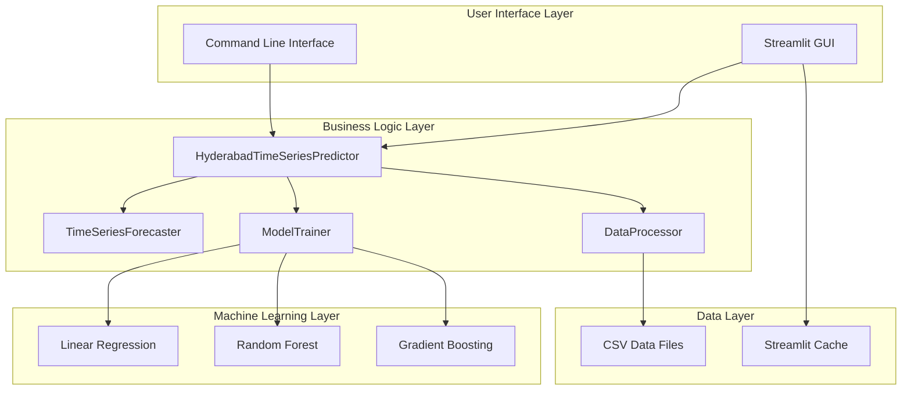
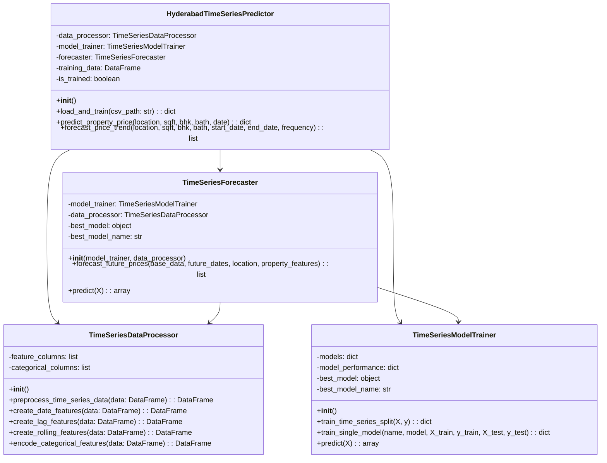
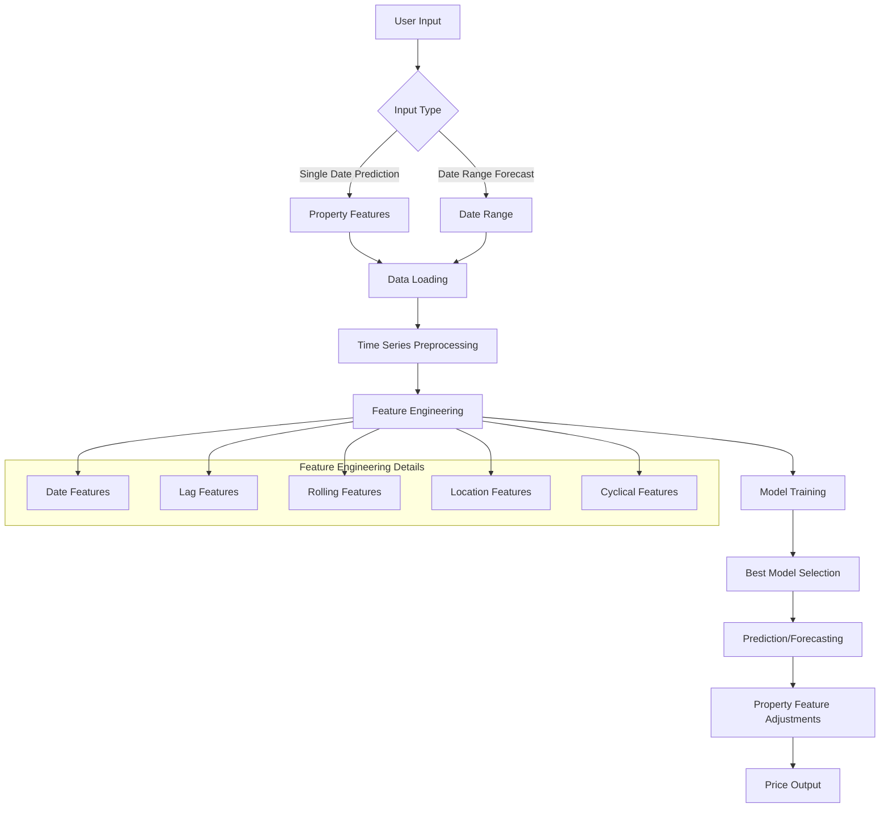
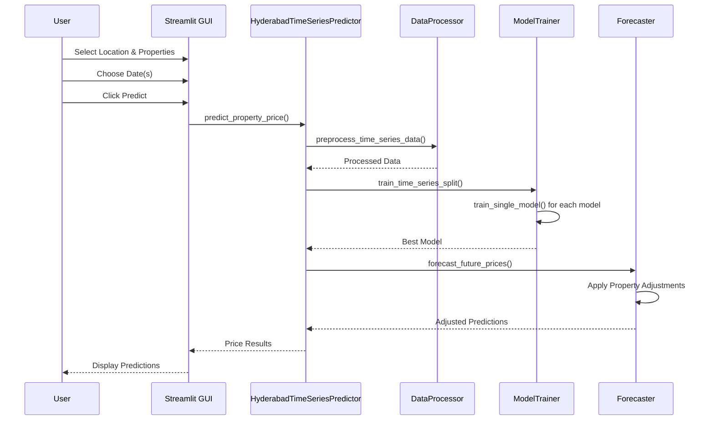
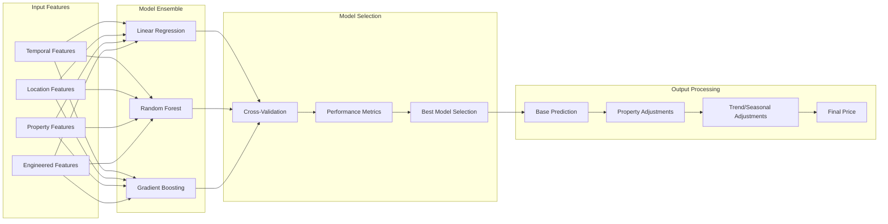
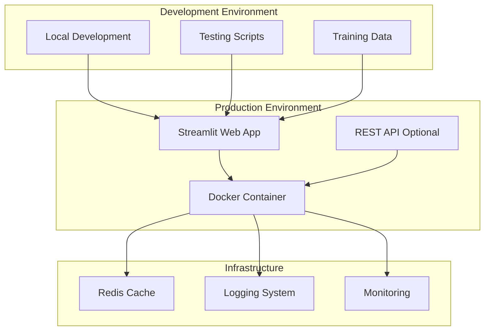
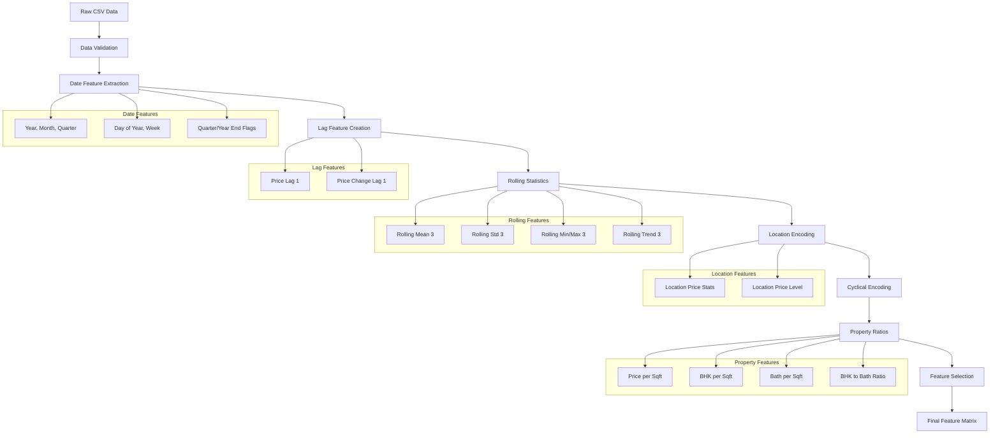
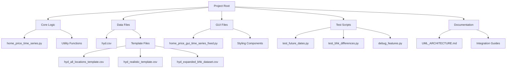
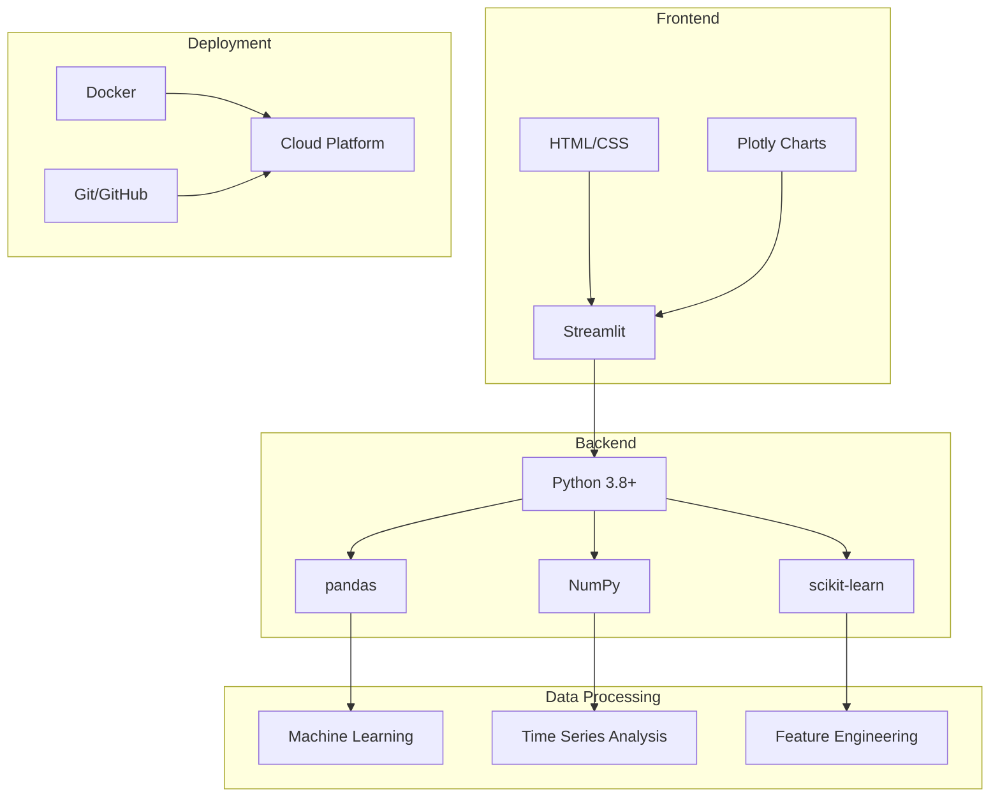

# Hyderabad House Price Prediction System - UML Architecture

## System Overview

The Hyderabad House Price Prediction System is a comprehensive time-series forecasting application that predicts property prices using machine learning models with temporal and spatial features.

## 1. High-Level Architecture Diagram



## 2. Class Architecture Diagram



## 3. Data Flow Architecture



## 4. Component Interaction Sequence



## 5. Data Model Architecture

```mermaid
erDiagram
    Property {
        date datetime PK
        location string
        total_sqft int
        bhk int
        bath int
        price float
        year int
        month int
        quarter int
        day_of_year int
        week_of_year int
        month_sin float
        month_cos float
        quarter_sin float
        quarter_cos float
        days_since_start int
        is_quarter_end boolean
        is_year_end boolean
        price_lag_1 float
        price_change_lag_1 float
        price_rolling_mean_3 float
        price_rolling_std_3 float
        price_rolling_min_3 float
        price_rolling_max_3 float
        price_rolling_trend_3 float
        location_price_mean float
        location_price_median float
        location_price_std float
        price_per_sqft float
        bhk_per_sqft float
        bath_per_sqft float
        bhk_to_bath_ratio float
        location_price_level string
    }
    
    Location {
        name string PK
        price_level string
        avg_price float
        price_variance float
    }
    
    Property ||--o{ Location
```

## 6. Model Architecture



## 7. Deployment Architecture



## 8. Feature Engineering Pipeline



## 9. File Structure Architecture



## 10. Technology Stack Architecture



## Key Architectural Principles

1. **Separation of Concerns**: Clear separation between data processing, model training, and prediction logic
2. **Modularity**: Each component can be tested and developed independently
3. **Scalability**: Architecture supports adding new models, features, and data sources
4. **Maintainability**: Well-structured codebase with clear interfaces
5. **Performance**: Efficient caching and optimized data processing pipelines
6. **Extensibility**: Easy to add new locations, features, and prediction types

## Design Patterns Used

1. **Strategy Pattern**: Multiple model training strategies
2. **Factory Pattern**: Model creation and selection
3. **Observer Pattern**: GUI updates based on model changes
4. **Template Method**: Standardized prediction workflow
5. **Decorator Pattern**: Caching and logging functionality
